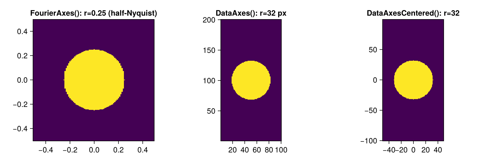

# Tilts and Axes {#guides/tilts_axes}

The tilt model is an affine function over coordinates x:

σ + τ · x

It’s stored as a static coefficient vector `[σ, τ₁, τ₂, …]` for performance and clarity.

## Types

- `Tilt` — abstract supertype. Coefficients layout `[σ, τ…]`.
- `TiltCentered` — concrete tilt, convenient for centered frames (e.g., Fourier coords).
- `FreeTilt` — concrete tilt without centering semantics.

Axis policies define coordinates per dimension:

- `ArrayAxes` — abstract supertype
- `FourierAxes()` — uses `fftshift(fftfreq(d))` per dimension
- `DataAxes()` — uses `1:d` per dimension
- `DataAxesCentered()` — uses `fftshift(fftfreq(d, d))` per dimension

## Basic usage

```julia
using PhaseUtils

# a 2D tilt: [σ, τx, τy]
t = TiltCentered([0.1, 0.2, -0.3])

# Fourier-domain axes for a 6×5 grid
ax = FourierAxes()((6, 5))

# Evaluate on provided axes
A = materialize(t, ax)
@assert size(A) == (6, 5)

# Apply to a single point (x, y)
val = apply(t, (0.5, -0.5))
```

## Choosing axes

- Use `FourierAxes()` when τ is defined in frequency units matching FFT conventions.
- Use `DataAxes()` when τ is in pixel-index units (1-based).
- Use `DataAxesCentered()` for integer-like centered coordinates (spatial domain centered at zero).

## Mutating coefficients

```julia
using PhaseUtils

c = TiltCentered([0.0, 1.0, 2.0])
setsigma!(c, 1.5)
settau!(c, [-2.0, 3.0])
setall!(c, [0.1, 0.2, 0.3])
```

## API

See: `@ref api` for the full reference.

## Examples: circle masks in different axes

Below we generate circle masks in three coordinate systems for a 100×200 grid and visualize them. In Fourier axes, coordinates span [-0.5, 0.5) in normalized frequency units (from −Nyquist to +Nyquist). A radius of 0.25 corresponds to half-Nyquist.
The matrix with Fourier axes is shown with a fixed aspect ratio.

```@example circles_axes
using PhaseUtils, CairoMakie

dims = (100, 200)

# Fourier axes: normalized frequency in [-0.5, 0.5)
mask_fourier = circlemask(dims, 0.25, FourierAxes())

# Data axes: 1-based indices, choose radius in pixels; center at (dims+1)/2 by default
radius_px = 32
mask_data = circlemask(dims, (dims[1]+1)/2, (dims[2]+1)/2, radius_px, DataAxes())

# Centered data axes: integer-like coordinates centered at zero (e.g., radius 32)
mask_centered = circlemask(dims, 32, DataAxesCentered())

f = Figure(resolution=(900, 300))
ax1 = Axis(f[1, 1], title="FourierAxes(): r=0.25 (half-Nyquist)", aspect = AxisAspect(1))
ax2 = Axis(f[1, 2], title="DataAxes(): r=32 px", aspect = DataAspect())
ax3 = Axis(f[1, 3], title="DataAxesCentered(): r=32", aspect = DataAspect())
heatmap!(ax1, FourierAxes()(mask_fourier)..., mask_fourier)
heatmap!(ax2, DataAxes()(mask_data)..., mask_data)
heatmap!(ax3, DataAxesCentered()(mask_centered)..., mask_centered)

assetdir = joinpath(@__DIR__, "..", "assets")
mkpath(assetdir)
save(joinpath(assetdir, "circle_masks_axes.png"), f)
f
```

The saved image will appear below if built with CairoMakie:



### Mutating example: materialize a tilt and mask a circle

This example creates a tilt, materializes it on Fourier axes, and masks (zeros) values outside a circular region of radius 0.25 (half-Nyquist):

```@example mask_tilt
using PhaseUtils, CairoMakie

dims = (100, 200)
t = TiltCentered([0.1, 0.3, -0.2])
A = materialize(t, FourierAxes()(dims))
B = copy(A)
circlemask!(B, 0.25, FourierAxes())

f = Figure(resolution=(600, 300))
ax1 = Axis(f[1, 1], title="Tilt (Fourier axes)", subtitle = "size(A) = $(size(A))", aspect = AxisAspect(1))
ax2 = Axis(f[1, 2], title="Masked outside r=0.25", aspect = AxisAspect(1))
heatmap!(ax1, FourierAxes()(A)..., A)
heatmap!(ax2, FourierAxes()(B)..., B)

f
```

### Using explicit ranges with ProvidedAxes

`ProvidedAxes` lets you bind arbitrary (possibly non-uniform) coordinate ranges. Ranges in Julia (e.g. `-1:0.1:1`) are `AbstractRange`s and already behave like vectors for indexing and broadcasting.

Basic 2D example with symmetric ranges at custom spacing:

```@example provided_axes
using PhaseUtils

xr = -1:0.1:1            # 21 points
yr = -0.5:0.05:0.5       # 21 points (different physical span / step)
pax = ProvidedAxes(xr, yr)

# Create a tilt with piston 0.0 and slopes 0.4 (x), -0.2 (y)
t = TiltCentered([0.0, 0.4, -0.2])
A = materialize(t, pax((length(xr), length(yr))))
size(A), A[1,1], A[end,end]
```

Non-uniform grids (e.g. quadratic spacing) work the same:

```@example provided_axes
xr2 = collect(range(-1, 1; length=64).^2 .* sign.(range(-1, 1; length=64))) # denser near zero
yr2 = range(-2, 2; length=48)
pax2 = ProvidedAxes(xr2, yr2)
t2 = TiltCentered([0.1, 0.05, 0.01])
B = materialize(t2, pax2((length(xr2), length(yr2))))
extrema(B)
```

If the requested `dims` mismatch the stored axes lengths an error is thrown:

```@example provided_axes
try
	pax((22, 21))  # xr has length 21 → mismatch
catch err
	println("Caught error: ", err.msg)
end
nothing
```
